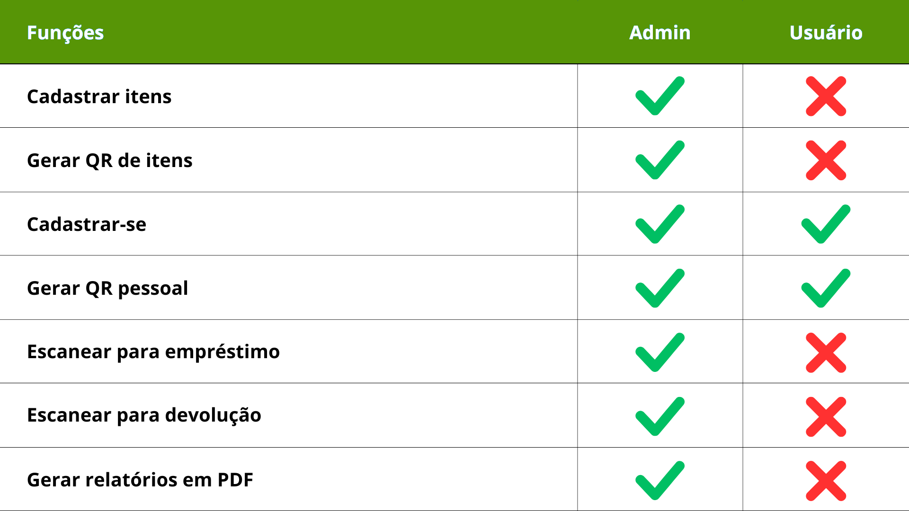

  

# 📱 Marquei! - Sistema de Empréstimos e Inventário

**Marquei** é um aplicativo offline para gerenciamento de inventário e empréstimos de itens, como laptops, livros e outros objetos, utilizando QR codes. Ideal para escolas, bibliotecas e organizações, o app permite o cadastro de objetos e usuários, além de registrar empréstimos e gerar relatórios, tudo sem necessidade de conexão à internet.

---

## 🧠 Visão Geral

- **Cadastro de itens**: Adicione laptops, livros e outros objetos ao sistema.
- **Cadastro de usuários**: Permite que usuários criem suas credenciais e gerem um QR code pessoal.
- **Empréstimo e devolução**: O administrador escaneia o QR code do item e do usuário para registrar empréstimos e devoluções.
- **QR Code**: Utilização de QR codes para facilitar o registro de empréstimos e a identificação dos itens e usuários.
- **Geração de relatórios**: Exportação de dados em PDF para controle de empréstimos e inventário.
- **Funciona offline**: Totalmente funcional sem conexão com a internet.

---

## 🛠️ Tecnologias Usadas

- **Android (Kotlin)**: Para o desenvolvimento do aplicativo móvel.
- **Room (SQLite)**: Banco de dados local para armazenamento offline.
- **ZXing ou MLKit**: Para geração e leitura de QR Codes.
- **PdfDocument**: Para geração de relatórios em PDF.

---

## 📸 Mockups & Screenshots

> Em breve mockups e protótipos aqui!

---

---

## ✅ Funcionalidades

---

## 📊 Como Funciona

1. **Cadastro de Itens**: O administrador pode cadastrar laptops, livros ou qualquer outro item, gerando automaticamente um QR Code para cada objeto.
2. **Cadastro de Usuários**: Usuários criam suas credenciais e geram um QR Code pessoal, que será escaneado pelo administrador ao fazer o empréstimo.
3. **Empréstimo e Devolução**: Para registrar um empréstimo ou devolução, o administrador escaneia os QR Codes do item e do usuário.
4. **Geração de Relatórios**: O administrador pode gerar e exportar relatórios em PDF com o inventário atual e os empréstimos realizados.
